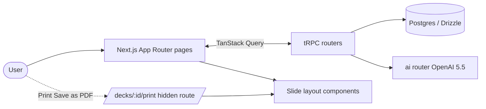

## Goals & ground rules

- **Demo flow** (judging weight 30%): Brand kit → prompt → AI plan → review/edit plan → generate slides → edit a slide → export PDF.
- **Stack**: Next.js 15 (App Router), tRPC v11, Drizzle + Postgres, Tailwind v4, OpenAI SDK (already installed). PDF via browser Print → Save as PDF from a dedicated print route — no headless Chrome. Keep the existing T3 scaffold ([src/server/api/trpc.ts](src/server/api/trpc.ts), [src/trpc/react.tsx](src/trpc/react.tsx)).
- **Editor scope**: template-driven only. Each layout exposes named slots; users edit text inline + swap layout. No free X/Y positioning.
- **Images**: AI generates image _briefs_ (text prompts). Slides render a styled placeholder that shows the prompt. (Bonus: real generation later.)
- **Auth**: none. Single hardcoded workspace. The "CD" avatar in the design is decorative.
- **PDF**: A hidden `/decks/[id]/print` route reuses the same React layout components; the user (or Export button via `window.print()`) saves PDF through the browser — same fidelity as on-screen slides, no extra packages.
- **Repo hygiene** (10%): every file ≤ 500 lines, components split aggressively, `cn` for conditional classes, conform to `globals.css` font tokens (no inline overrides).
- **Verification**: manual demo flow only — no automated unit/integration/e2e tests in MVP scope (no CI test steps in README).

---

## Architecture at a glance



Slide layouts are the single source of truth: editor canvas, dashboard thumbnails, brand-kit live preview, and PDF print page all render the same `<SlideFrame>` + `<XxxLayout>` components from `src/components/slides/`.

---

## Stage 0 — Foundation (~2h)

- **No new npm packages** — T3 already ships `zod`, `clsx`, `tailwind-merge`, and this repo already has `openai` plus [`src/lib/cn.ts`](src/lib/cn.ts) via [`src/lib/utils.ts`](src/lib/utils.ts).
- Extend [src/env.js](src/env.js) `server` schema with `OPENAI_API_KEY: z.string().min(1)` and add it to `runtimeEnv` (the key is already present in [.env](.env)).
- Add `src/lib/openai.ts` (singleton client), `src/lib/contrast.ts` (WCAG ratio).
- Replace [src/styles/globals.css](src/styles/globals.css): import the design tokens from [design/design-system/colors_and_type.css](design/design-system/colors_and_type.css) (paste the `:root` block + `--app-*` chrome tokens from [design/index.html](design/index.html)) and define text utility classes (`.t-display`, `.t-body`, etc.) here so we never apply inline font sizes.
- Replace [src/app/layout.tsx](src/app/layout.tsx) metadata + body to "Slideline" and drop the Geist gradient demo.

## Stage 1 — Data model (~3h)

Replace the example posts table in [src/server/db/schema.ts](src/server/db/schema.ts) with three core tables (and one optional). All keep the `slide-builder_` prefix from the existing `pgTableCreator`.

- `brandKits`: `id` (uuid), `name`, `logoUrl` (nullable), `colors` (jsonb: `{bg,fg,accent,highlight}`), `fontDisplay`, `fontText`, `tone` (`'direct'|'warm'|'technical'`), `imageStyle`, `isDefault` (bool), timestamps.
- `decks`: `id`, `brandKitId` (fk), `title`, `prompt` (text), `status` (`'draft'|'planned'|'generated'|'edited'|'exported'`), `settings` (jsonb: `{slideCount, audience, tone, layoutsAllowed[]}`), `templateConfig` (jsonb: `{pageNumber:{...}, topRightTitle:{...}, logo:{...}}`), timestamps.
- `slides`: `id`, `deckId` (fk, on delete cascade), `position` (int), `layout` (enum), `content` (jsonb — slot map keyed by layout, see Stage 6), `imagePrompt` (text), `speakerNotes` (text), `templateOverrides` (jsonb), timestamps. Index on `(deckId, position)`.
- Optional `deckExports` (`id, deckId, pdfPath, createdAt`) for "Recent exports" — stretch.

Add a tiny seed script `src/server/db/seed.ts` that inserts the **Iron Den Fitness** brand kit so the demo always opens to something pretty.

## Stage 2 — Shared shell + design primitives (~4h)

Port the chrome from [design/screens/shell.jsx](design/screens/shell.jsx) and the `<style>` block in [design/index.html](design/index.html) into real React components under `src/app/_components/shell/` and `src/app/_components/ui/` (each file ≤ 200 lines):

- `shell/AppNav.tsx` — top bar with brand mark, breadcrumb, search placeholder, avatar, right-slot.
- `shell/Sidebar.tsx` — Recent / AI plans / Templates / Trash + brand-kit list (data from tRPC `brandKit.list`). Uses `next/link` for routing.
- `shell/Artboard.tsx` — flex column wrapper that hosts AppNav + (Sidebar | main).
- `ui/Button.tsx` (variants: `primary | dark | ghost | icon | lg`), `ui/Chip.tsx`, `ui/Toggle.tsx`, `ui/Field.tsx` (label + input), `ui/SegBtn.tsx`, `ui/Slider.tsx`, `ui/NumberField.tsx`, `ui/StepDots.tsx` (the 1-2-3 step header in [NewDeck.jsx](design/screens/NewDeck.jsx)/[Preprocess.jsx](design/screens/Preprocess.jsx)), `ui/Icons.tsx` (port the inline SVGs from `shell.jsx` into a single icon module).

Update [src/app/layout.tsx](src/app/layout.tsx) to set the default body background and load Inter from `next/font/google` as the fallback for `--font-text`/`--font-display`.

## Stage 3 — Brand kit CRUD (Screen 02) (~6h)

- tRPC `brandKitRouter`: `list`, `byId`, `create`, `update`, `delete`, `setDefault`.
- Route `app/brand-kits/[id]/page.tsx` mirrors [design/screens/BrandKit.jsx](design/screens/BrandKit.jsx) — split into:
  - `_components/LogoUploader.tsx` (file → data URL for the demo; no S3 needed).
  - `_components/PaletteEditor.tsx` (4 swatches + hex inputs, uses `lib/contrast.ts` to show WCAG ratio).
  - `_components/FontPicker.tsx` (Inter + system stack to start; preset list).
  - `_components/ToneSelector.tsx`, `_components/ImageStyleSelector.tsx`.
  - `_components/LivePreview.tsx` — renders `<SlideFrame brandKit><ImageTextLayout sample/></SlideFrame>` (Stage 6 component) so the user sees changes immediately.
  - `_components/ComplianceCard.tsx` — pass/warn based on contrast + logo presence.
- New brand kit at `app/brand-kits/new/page.tsx` reuses the same form components.

## Stage 4 — Dashboard (Screen 01) (~3h)

- Replace [src/app/page.tsx](src/app/page.tsx) with the Dashboard from [design/screens/Dashboard.jsx](design/screens/Dashboard.jsx).
- tRPC `deckRouter.list` returns decks joined with their first slide for the thumbnail.
- Components: `dashboard/_components/NewDeckHero.tsx`, `DeckCard.tsx`, `DeckThumb.tsx` (uses `<SlideFrame width={248}>` for true brand-accurate thumbnails).
- Filter tabs are state-only for now (All / AI plans / Generated / PDF exported). Sort = `Last edited` (default).
- "+ New deck" → `/decks/new`.

## Stage 5 — Prompt → AI plan (Screens 03 + 04) (~8h, biggest stage)

### 5a. New deck (`/decks/new`)

- Mirror [design/screens/NewDeck.jsx](design/screens/NewDeck.jsx) UI.
- State: `prompt`, `brandKitId`, `slideCount` (4–30 slider), `audience`, `tone`, `layoutsAllowed[]` (chip toggles), `imagesMode` (prompt-only for now), `notesMode` (`'short'|'long'|'off'`), `previewBeforeGenerate` (bool, default true).
- "Plan the deck" CTA → tRPC `ai.planDeck` mutation → redirect to `/decks/[id]/plan` with the freshly created deck + slide rows.

### 5b. The AI call (`src/server/api/routers/ai.ts`)

- Use OpenAI `responses.create` with `gpt-5.5` and a strict **structured output** JSON schema (hand-write JSON Schema matching your plan/slot shapes — keep it aligned with Zod validators / `layoutDefs` if you duplicate definitions) of:
  ```ts
  {
    slides: Array<{
      n: number;
      layout:
        | "title"
        | "section"
        | "imageText"
        | "quote"
        | "comparison"
        | "statHero"
        | "closing";
      title: string;
      body?: string;
      bullets?: string[];
      quote?: { text: string; author: string };
      comparison?: { columns: Array<{ heading: string; rows: string[] }> };
      stat?: { number: string; label: string };
      imagePrompt: string;
      speakerNotes?: string;
    }>;
  }
  ```
- System prompt encodes brand kit (tone, palette, image style) + `settings`. Persist the response into `decks.planJson` (raw, for "Regenerate plan") and into typed `slides` rows.
- Add `ai.rewriteSlide` (used by the "Rewrite" button on each plan card) and `ai.generateSlides` (no-op for now since plan IS the generated content; just flips `status` to `'generated'` and routes to `/edit`).

### 5c. Plan / preprocess (`/decks/[id]/plan`)

- Mirror [design/screens/Preprocess.jsx](design/screens/Preprocess.jsx).
- Stats strip is computed (`slides.length`, distinct layouts, image-prompt count, notes-coverage, brand kit name, template summary, est. talk time = slides × 45s).
- `_components/PlanCard.tsx` (≤ 250 lines) — inline contentEditable for title + body + bullets + image prompt + notes; debounced `slide.update` mutation; shows "Editing" chip when focused.
- "Generate slides" → `ai.generateSlides` → `/decks/[id]/edit`.
- Plan UI is inline edit only; slide **order stays creation order** (no reorder UI in MVP).

## Stage 6 — Slide layout primitives (~6h)

These are the heart of the app — used by editor canvas, thumbnails, brand-kit preview, and PDF.

- `src/components/slides/SlideFrame.tsx` — fixed 1280×720 unit, `transform: scale()` to fit a target `width`. Renders the template chrome (page number, top-right title, logo) based on `brandKit` + `templateConfig` + `slideOverrides`. Pattern from [design/screens/IronDenSlide.jsx](design/screens/IronDenSlide.jsx).
- `src/components/slides/layouts/` — one file per layout, each ≤ 200 lines, props typed as `{ brandKit, content }` where `content` is the slot map for that layout:
  - `TitleLayout.tsx` — eyebrow, title, subtitle.
  - `SectionLayout.tsx` — eyebrow, title, optional bullets.
  - `ImageTextLayout.tsx` — title, body, stats, image-prompt placeholder.
  - `QuoteLayout.tsx` — quote, author.
  - `ComparisonLayout.tsx` — columns × rows (highlighted column = "us").
  - `StatHeroLayout.tsx` — large number + label + sub.
  - `ClosingLayout.tsx` — closing line + CTA.
- `src/components/slides/ImagePromptPlaceholder.tsx` — the dark gradient + "AI · IMAGE BRIEF" overlay from [design/screens/Preprocess.jsx](design/screens/Preprocess.jsx)/[IronDenSlide.jsx](design/screens/IronDenSlide.jsx). Shows the prompt text on hover.
- `src/lib/layouts.ts` — TS types for each layout's slot shape + a `layoutDefs` registry consumed by both AI structured output and the editor inspector.

## Stage 7 — Slide editor — template-driven (Screen 05) (~6h)

- `app/decks/[id]/edit/page.tsx` — overall shell from [design/screens/Editor.jsx](design/screens/Editor.jsx).
- Components (each ≤ 200 lines):
  - `_components/EditorToolbar.tsx` — title (editable), saved-state, Add slide menu, brand-kit chip, Share (no-op), Export PDF (Stage 9).
  - `_components/SlideRail.tsx` — left rail of `<SlideFrame width={170}>` thumbnails; click selects; `+` adds.
  - `_components/SlideCanvas.tsx` — center, `<SlideFrame width={720}>`. Title shows zoom badge + layout chip + "Change layout" dropdown.
  - `_components/inspector/InspectorTabs.tsx` — Slide / Element / Template / Notes.
  - `_components/inspector/SlideTab.tsx` — layout picker grid (`LayoutThumb`s reused) + per-slide template overrides.
  - `_components/inspector/ElementTab.tsx` — **dynamic form**: looks up `layoutDefs[currentSlide.layout].slots` and renders one input per slot (title → input, body → textarea, bullets → list editor, quote → 2 fields, comparison → table editor, stat → 2 fields, image prompt → textarea + "Re-roll prompt" button calling `ai.rewriteSlide`).
  - `_components/inspector/NotesTab.tsx` — speaker-notes textarea.
- Mutations: `slide.update` (debounced 500 ms), `slide.changeLayout`, `slide.add`, `slide.delete`, `slide.duplicate`.

## Stage 8 — Template controls (Screen 06) (~3h)

- `_components/inspector/TemplateTab.tsx` — mirror [design/screens/TemplateControls.jsx](design/screens/TemplateControls.jsx):
  - Page number: enabled, format (`01/10 | 1 of 10 | 01 | •`), position, font size, "skip on title & closing".
  - Top-right title: enabled, source token (`{{slide.section}}` vs `{{deck.title}}`), case (`upper|title|none`), letter-spacing.
  - Brand logo: enabled, position, opacity, "show wordmark".
  - Per-slide overrides: list of `{slideId, hideElements: ['pageNumber'|'topRight'|'logo']}`.
- `SlideFrame` already reads `templateConfig` + per-slide overrides — this tab only writes to `decks.templateConfig` / `slides.templateOverrides`.
- "Editing template chrome" annotation overlay on canvas (from `TemplateCanvas` in the design) — only shown when this tab is active.

## Stage 9 — PDF export (~2–3h)

Path: reuse slide components on a print-only page → user saves PDF via the browser (Chrome/Edge “Save as PDF”). No server-generated PDF binary and no headless browser.

- New route `app/decks/[id]/print/page.tsx`:
  - Server component. Fetches deck + slides + brand kit.
  - Renders **all slides** in document order, each wrapped in a `<div style="width:1280px;height:720px; page-break-after:always">` containing `<SlideFrame width={1280}>`.
  - Adds a print-only stylesheet: `@page { size: 1280px 720px; margin: 0 } body { margin: 0 }`.
  - Token-gated via `?token=...` query (signed per deck) so it isn't trivially public.
- Small **client** helper on the print page (or opened from the editor): `window.print()` after paint so “Export PDF” in `EditorToolbar` can open this route in a tab/window and invoke print, or deep-link with instructions to choose “Save as PDF” as the destination.
- Optional tRPC `deck.markExported` (or reuse `deck.update`) after print dialog closes — MVP can skip strict detection and only flip `status = 'exported'` when the user confirms, or leave status unchanged until you add telemetry later.
- (Optional) `deckExports` row remains a stretch if you ever add server-side PDF again.

## Stage 10 — Polish, seed, demo prep (~4h)

- **Demo seed**: extend `seed.ts` with Iron Den Fitness brand kit + the 10-slide sales proposal deck from [design/screens/Preprocess.jsx](design/screens/Preprocess.jsx) so the dashboard isn't empty on first load.
- Loading/empty states: AI calls take ~10–12 s — add a skeleton on the plan page + a "Drafting plan…" toast with progress text from the design.
- Empty state for Dashboard before any decks exist.
- Error toast for OpenAI failures.
- README updates: setup steps (`bun install`, `start-database.sh`, `bun run db:push`, `bun dev`), demo script, env vars.

### Bonus picks if time allows (in priority order)

1. "Rewrite" buttons on individual element fields (already partially scaffolded by `ai.rewriteSlide`).
2. Brand-compliance warning banner on slides with low contrast (uses `lib/contrast.ts` already built in Stage 3).
3. Speaker notes generation pass (separate `ai.generateNotes`).
4. Real image generation (gpt-image-1) toggle on the new-deck page (would slot in Stage 5 cleanly because `imagesMode` already exists).

---

## What I'm explicitly NOT doing (and why)

- No auth, no multi-tenancy. The brief doesn't require it and it's pure cost in 4-5 days.
- No file storage service. Logo and any future image data go in Postgres as base64/data URLs (fine for demo scale).
- No free-canvas editing, no undo/redo. The editor is template-driven per your decision.
- No real image generation in the MVP — image prompts only. Stage 10 bonus #4 unlocks it cleanly when ready.
- No drizzle migration commands listed (per your standing rule). Schema changes go in [src/server/db/schema.ts](src/server/db/schema.ts) and you push however you prefer.
- No build / lint / typecheck commands listed (per your standing rules).
- No automated tests (unit, integration, or e2e) in MVP scope — verify via the scripted demo flow only.
- No Puppeteer or server-streamed PDF binaries — export is browser Print → Save as PDF from the print route.
